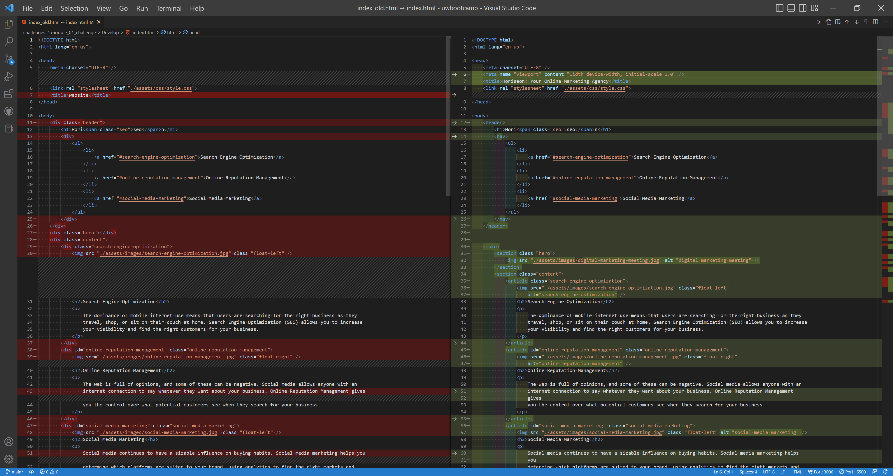
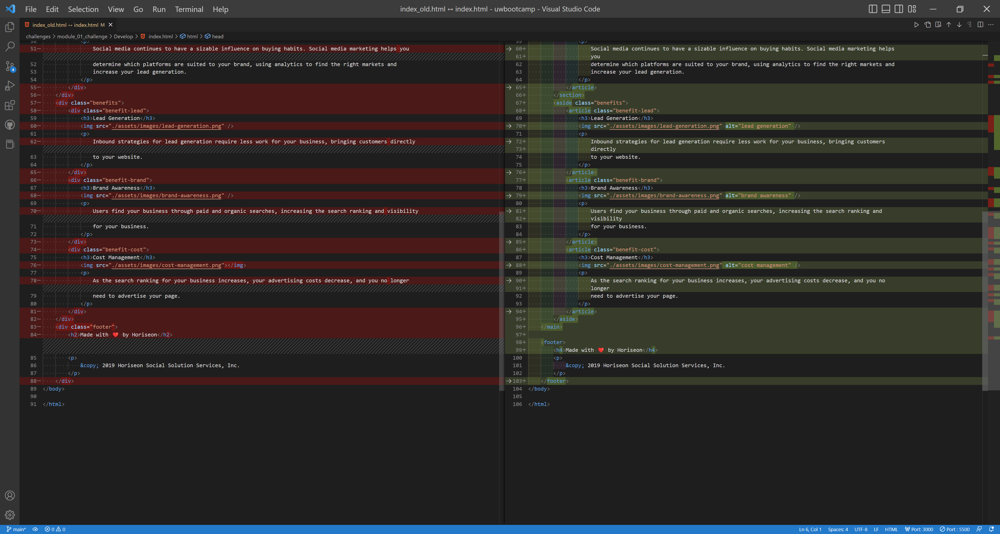
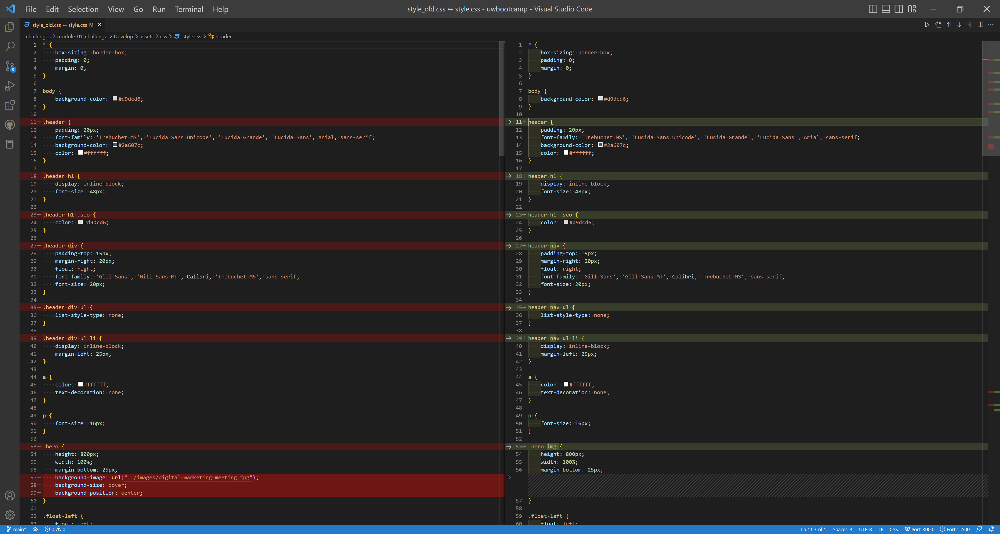
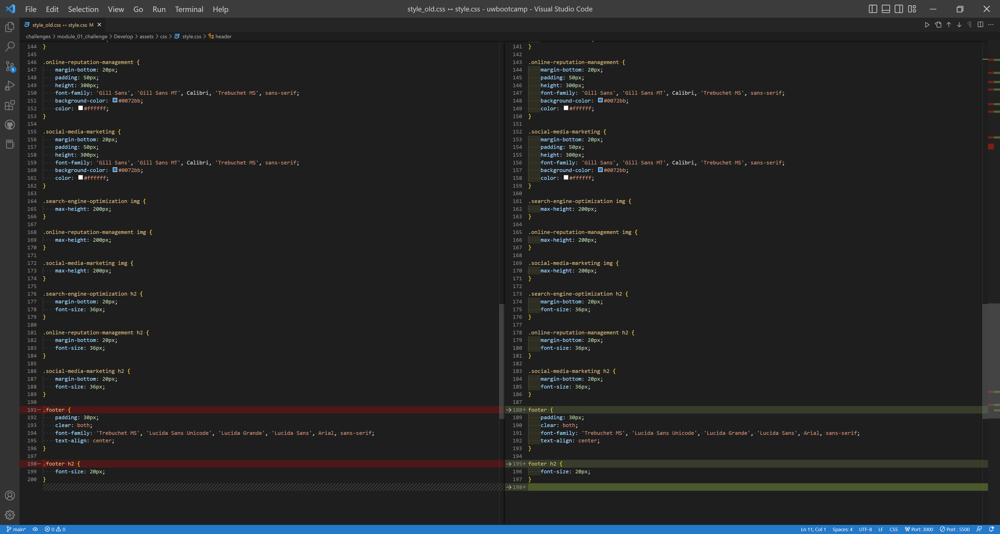

# Refactoring for Better Web Accessbility

## Description

The goal of this project is to refactor the existing code of a marketing agency's website to imporve its web accessbility so that not only people with disabilities can access the website more easily but also the website can be optimized better for search engines.

## Installation

No special requirements.

## Screenshots

[Index Page Screenshot]

[Refactoring HTML codes before (left) & after (right) part 1]

[Refactoring HTML codes before (left) & after (right) part 2]

[Refactoring CSS codes before (left) & after (right) part 1]

[Refactoring CSS codes before (left) & after (right) part 2]

## Credits

https://github.com/coding-boot-camp/urban-octo-telegram

## License
Copyright © 2022 [Claire Cho](https://github.com/clairehwcho).